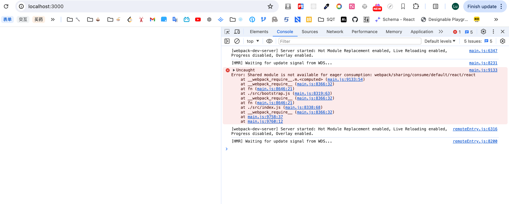

// yarn add html-webpack-plugin react react-dom webpack webpack-cli babel-loader @babel/core webpack-dev-server @babel/preset-react

容器就是一个项目

容器=人
远程容器=服务员 奉献者 向外提供服务
主机容器=顾客   索取者 访问或者使用别人的服务

react 规定异步加载的组件都要用 suspense 包裹
suspense 悬停，可以做到在数据回来之前先显示 fallback 的内容，等数据回来之后才显示真正的组件

# Problems

solution: https://stackoverflow.com/questions/72273886/react-module-federation-uncaught-error-shared-module-is-not-available-for-eag

谁先加载就用谁的，优先使用共享的，谁先放到共享库里，就先用谁的